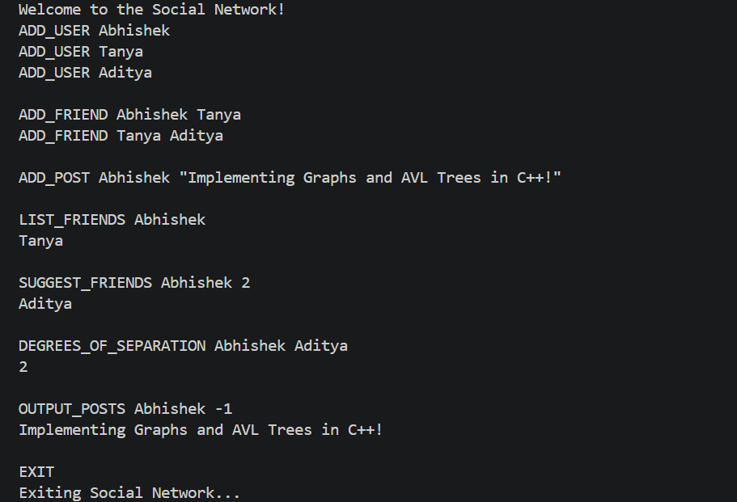

# Social Network Simulator

A command-line social network simulator implemented in **C++** using **Graphs**, **Breadth First Search (BFS)** and **AVL Trees**.

---

## Overview

This project simulates a miniature social networking platform where users can:

- Create accounts
- Form friendships
- Create posts
- Get friend recommendations
- Find degrees of separation between users
- View recent posts

The project demonstrates the implementation and application of fundamental data structures and algorithms in C++.

---

## Features

### User Management

- Add new users
- Prevent duplicate users

### Friendship Network

- Add friendships between users
- List friends alphabetically

### Friend Recommendations

- Suggest friends based on the number of mutual friends
- Rank suggestions by:
  1. Number of mutual friends
  2. Lexicographical order of usernames

### Degrees of Separation

- Compute the shortest friendship path between two users
- Implemented using **Breadth First Search (BFS)**

### Post Management

- Add posts with timestamps
- Retrieve the most recent posts efficiently

---

## Data Structures Used

| Component | Data Structure |
|----------|----------------|
| Users | Vector of User objects |
| Friendships | Graph (Adjacency List) |
| Friend Suggestions | Mutual Friend Analysis |
| Shortest Path | Breadth First Search (BFS) |
| Posts | AVL Tree |

---

## Project Structure

```text
social-network-simulator-cpp

├── src
│   ├── main.cpp
│   ├── graph.cpp
│   ├── user.cpp
│   └── avl.cpp
│
├── include
│   ├── graph.hpp
│   ├── user.hpp
│   └── avl.hpp
│
├── compile.sh
├── LICENSE
└── README.md
```

---

## Algorithms Implemented

### Breadth First Search (BFS)

Used to compute:

- Degrees of separation
- Shortest friendship path

**Time Complexity**

```text
O(V + E)
```

where:

- V = Number of users
- E = Number of friendships

---

### AVL Tree

Used for:

- Storing posts
- Maintaining chronological ordering
- Efficient insertion and retrieval

**Time Complexity**

| Operation | Complexity |
|----------|-----------|
| Insert Post | O(log n) |
| Retrieve Recent Posts | O(log n) + O(k) |

---

## Compilation

```bash
g++ -std=c++17 src/main.cpp src/graph.cpp src/user.cpp src/avl.cpp -I include -o socialnet
```

---

## Running the Program

Linux / Mac:

```bash
./socialnet
```

Windows:

```powershell
.\socialnet.exe
```

---

## Sample Interaction

```text
Welcome to the Social Network!

ADD_USER Abhishek
ADD_USER Tanya
ADD_USER Aditya

ADD_FRIEND Abhishek Tanya
ADD_FRIEND Tanya Aditya

ADD_POST Abhishek "Building my first Social Network Simulator in C++!"

LIST_FRIENDS Abhishek
Tanya

SUGGEST_FRIENDS Abhishek 2
Aditya

DEGREES_OF_SEPARATION Abhishek Aditya
2

OUTPUT_POSTS Abhishek -1
Building my first Social Network Simulator in C++!

EXIT
Exiting Social Network...
```

---

## Demo



---

## Future Improvements

- Persistent file storage
- Graph visualization using Graphviz
- User profiles with additional metadata
- Faster username lookup using hash maps
- Enhanced recommendation algorithms

---

## Author

**Abhishek Mehta**

B.Tech Electrical Engineering  
Indian Institute of Technology Delhi
